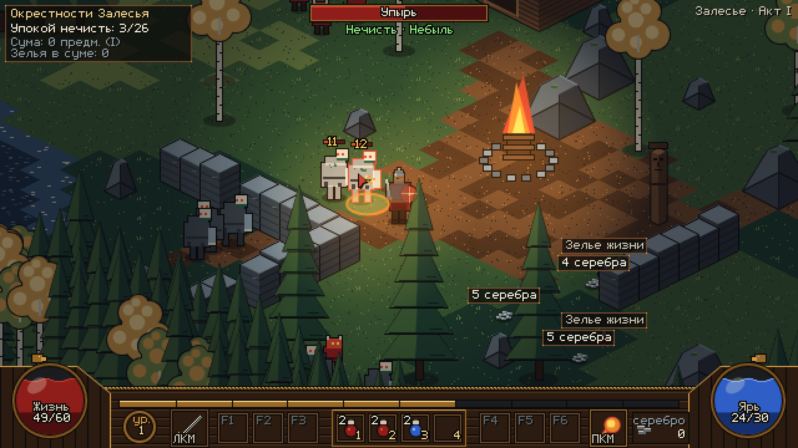

# «Быль и Небыль» — грей-бокс прототип, итерация 1

Браузерная action-RPG в духе Diablo II. Сеттинг «Гардарики», локация «Окрестности Залесья» (миссия 1, акт I).
Всё нарисовано простыми фигурами (грей-бокс) в палитре `art/ui/palette_v2.json`. Нативное разрешение 640×360,
целочисленный масштаб ×3 (1920×1080), псевдоизометрия 2:1 (тайл 32×16).



## Как запустить

Нужен только Python 3 и любой современный браузер (Chrome, Firefox, Edge). Сборка не нужна, внешних зависимостей
и CDN нет: чистые ES-модули и Canvas 2D.

```sh
cd /workspace/game/prototype
./run.sh              # или: python3 -m http.server 8000
# открыть http://localhost:8000/
```

Просто открыть `index.html` двойным щелчком нельзя: браузер не загружает ES-модули по `file://`.

Параметры адреса:
- `?debug` — FPS в правом верхнем углу;
- `?seed=N` — детерминированная случайность (урон, добыча, разброс врагов) для отладки и автотестов.

В консоли браузера доступен `window.__game` (состояние игры и помощник `clientOf(x, y)` для тестов).

## Управление

| Ввод | Действие |
|---|---|
| ЛКМ по земле / зажать ЛКМ | идти (путь обходит препятствия) |
| ЛКМ по нечисти | подойти и ударить мечом; если держать ЛКМ, герой бьёт дальше |
| ЛКМ по подписи на земле | подойти и подобрать (серебро, зелья, предметы) |
| ПКМ (можно зажать) | «Перунов огонь»: огненный шар со взрывом по площади, 6 яри |
| 1–4 (или щелчок по ячейке пояса) | выпить зелье из пояса |
| I / C | сума и характеристики |
| Esc | пауза со списком управления / закрыть окно |
| Enter или щелчок на экране смерти | начать заново |

## Что сделано

- **Локация** 48×48 тайлов: лесная кромка, берег Волхова (вода), две избы, частокол с воротами и факелами,
  крада (обрядовый костёр) со светом, чур, каменные развалины с проломами, отдельная стена у старта, валуны, ели
  и берёзы. Коллизия кругов с тайлами, скольжение вдоль стен.
- **Масштаб** по `design/scale.md`: герой 44 px, упырь 40, анчутка 26; ель 128–160, берёза 96–128, частокол 80
  (столбы ворот 96), изба 4×4 (стена 68, охлупень 112), крада 2×2, чур 62. Камера ставит подошвы героя в (320, 178),
  игровое поле 640×314. Персонажи и отдельные объекты обведены контуром 1 px (`ink`), враг под курсором обведён
  красным. «Рентген»: объекты, которые закрывают героя или врага под курсором, становятся полупрозрачными.
  Добыча на земле всегда рисуется под персонажами.
- **Движение**: клик и удержание ЛКМ. Поиск пути A* (8 направлений, углы не срезаются) со сглаживанием по прямой
  видимости. Если цель недостижима, герой идёт к ближайшей достижимой клетке. Отметка клика на земле.
- **Бой**: ЛКМ по врагу = подойти на дистанцию и ударить (замах, след удара, урон в момент удара). Удержание ЛКМ
  продолжает атаку. ПКМ — «Перунов огонь» (тратит Ярь, снаряд взрывается о врага, стену или в конце дальности,
  урон по площади растёт с уровнем). Всплывающие цифры урона, вспышка при попадании, частицы, свет от взрыва.
- **Нечисть из `story/act1.md`**:
  - Упырь: медленный, бьёт больно, ходит стаей.
  - Анчутка: быстрый бес, бьёт и отскакивает.
  - ИИ: бродит у логова, замечает героя в радиусе агрессии (если видит его), поднимает всю стаю, преследует
    (по прямой или по пути A*), бьёт с замахом. Если отойти слишком далеко от логова, возвращается и
    восстанавливает здоровье.
  - Зачищенная стая возрождается через 40 с, если героя нет рядом.
- **Шары Жизнь / Ярь** с уровнем «жидкости», реген, **пояс 1–4** со стопками зелий (до 4 в ячейке). Зелья
  жизни и яри лечат постепенно, лишние зелья кладутся в суму и сами пополняют пустую ячейку.
- **Опыт и уровни**: полоса опыта, «Новый уровень!» со столпом света. Растут Жизнь, Ярь, урон и броня, шары
  восполняются.
- **Добыча**:
  - С нечисти падают серебро, зелья и предметы трёх редкостей: обычные, «синие» с суффиксом («Шелом медведя»)
    и редкие («Меч-кладенец»).
  - На земле лежат подписи, как в D2. Плашки раздвигаются, чтобы не перекрываться, и подсвечиваются при наведении.
  - Подбор щелчком по подписи. Журнал подобранного, счётчики в трекере, окно сумы (I).
- **HUD по макету v2**: панель, корпуса шаров, полоса опыта, медальон уровня, слоты ЛКМ и ПКМ, пустые F1–F6,
  пояс, серебро. Сверху полоса цели с именем врага, трекер «Упокой нечисть N/M», подсказки к слотам, свой курсор.
  Весь текст набран растровым шрифтом `FONT_RU` из `art/ui/src/fonts_ru.py`, перенесённым в `src/data/font_ru.js`.
- **Смерть**: экран «Ратибор пал» со статистикой. Enter или щелчок перезапускает игру.

## Структура кода

```
index.html            холст 640×360, CSS pixelated, масштаб — в main.js
run.sh                локальный сервер
src/
  main.js             вход, целочисленный масштаб под окно, игровой цикл (dt ≤ 50 мс)
  game.js             состояние, ввод → команды герою, наведение, спавн и возрождение, смерть и рестарт
  config.js           разрешение, тайл, PANEL_Y, камера, размер карты
  palette.js          палитра v2 и цвета редкости
  core/               font.js (растровый шрифт + кэш надписей), input.js, iso.js (мир ↔ экран), rng.js, math.js
  world/              map.js (генерация локации, пропсы, стаи), collision.js, pathfind.js (A*)
  entities/           actor.js (движение по пути), hero.js, enemy.js (ИИ)
  systems/            combat.js (удар, снаряд, взрыв), loot.js (выпадение, подбор), fx.js, log.js
  data/               enemies.js, skills.js, items.js, progression.js — все балансные числа здесь
  render/             world.js (пол, сортировка по глубине, свет, подписи), props.js (препятствия, запекаются в спрайты),
                      sprites.js (герой, враги, лут), hud.js, screens.js (смерть, пауза, сума), shapes.js
tools/
  export_font.py      пересобрать src/data/font_ru.js из art/ui/src/fonts_ru.py
  verify_playwright.py автопроверка в headless Chromium (см. ниже)
```

Чтобы заменить грей-бокс на пиксель-арт, хватит переписать функции в `render/sprites.js` и `render/props.js`:
у них есть точка привязки (pivot = подошвы или угол футпринта), а логика игры от них не зависит. Новые враги,
умения и предметы добавляются в `data/*`.

## Автопроверка

```sh
python3 -m http.server 8765 &                     # из папки prototype
python3 -m venv /tmp/pw && /tmp/pw/bin/pip install playwright
/tmp/pw/bin/python -m playwright install chromium   # или передать --chrome /usr/bin/google-chrome
/tmp/pw/bin/python tools/verify_playwright.py [--chrome /usr/bin/google-chrome]
```

Скрипт загружает страницу и проверяет, что в консоли нет ошибок. Потом по шагам:
1. Клик-движение с обходом стены.
2. Движение с зажатой ЛКМ.
3. Бой: ЛКМ по врагу и ПКМ, который должен потратить Ярь.
4. Начисление опыта.
5. Зелье на клавишу 1.
6. Подбор по подписи.
7. Смерть и рестарт.

В конце скрипт снимает `screenshot_iter1.png` (1920×1080). Последний прогон: все проверки пройдены, консоль чистая.

## Известные ограничения

- Сетка проходимости — целые тайлы. В стандарте масштаба сабтайл 16×8 и шаг A* 0,5 тайла.
- Враги не загораживают героя: он проходит сквозь них. Враги расталкивают друг друга и отходят от героя.
- Взрыв «Перунова огня» бьёт сквозь стены, проверки прямой видимости нет.
- Подписи добычи всегда видны (переключения Alt нет). Они могут лечь поверх героя или врага, и щелчок по подписи
  важнее щелчка по врагу (так же в D2).
- Предметы только собираются в список, характеристик и экипировки пока нет. Слоты F1–F6 пустые.
- Когда ячейка пояса пустеет, зелья в поясе не сдвигаются (в D2 сдвигаются).
- Смерть означает полный рестарт: штрафа, трупа и возрождения у костра нет.
- У героя и врагов в грей-боксе только два направления взгляда (влево и вправо).
- Нет звука, мини-карты и главного меню. Карта собирается кодом с фиксированным сидом, Tiled не используется.
- `?seed` фиксирует случайные числа, но бой в реальном времени всё равно немного зависит от частоты кадров.
- Производительность: в headless Chrome без GPU (программная отрисовка) кадр занимает около 7 мс, в обычном браузере
  с GPU запас большой. Самое дорогое — освещение (радиальные градиенты каждый кадр).
