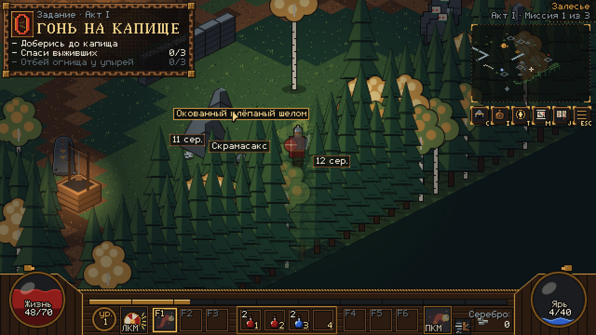
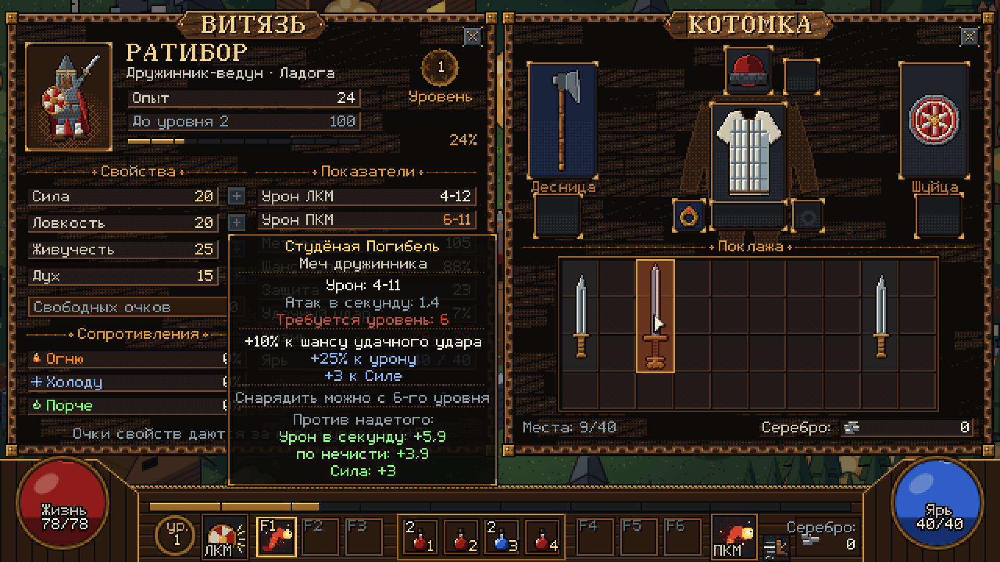
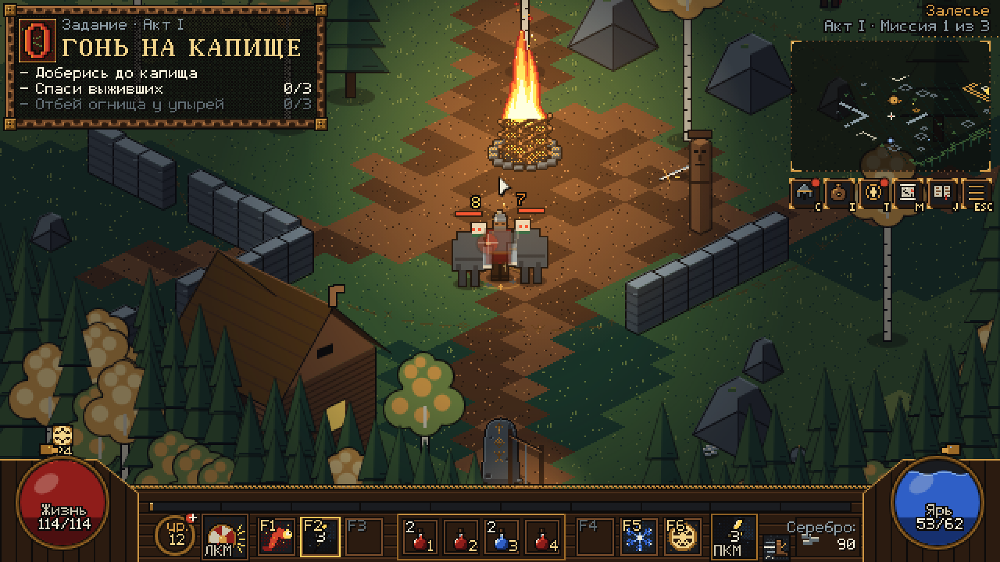
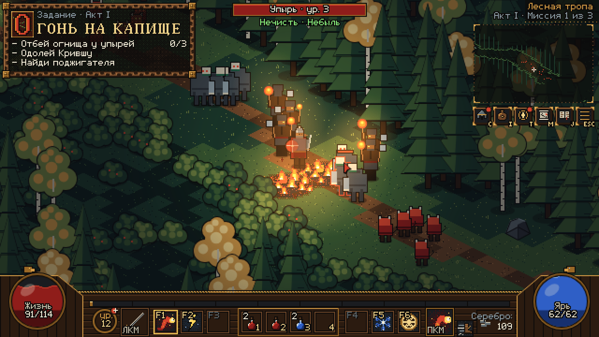
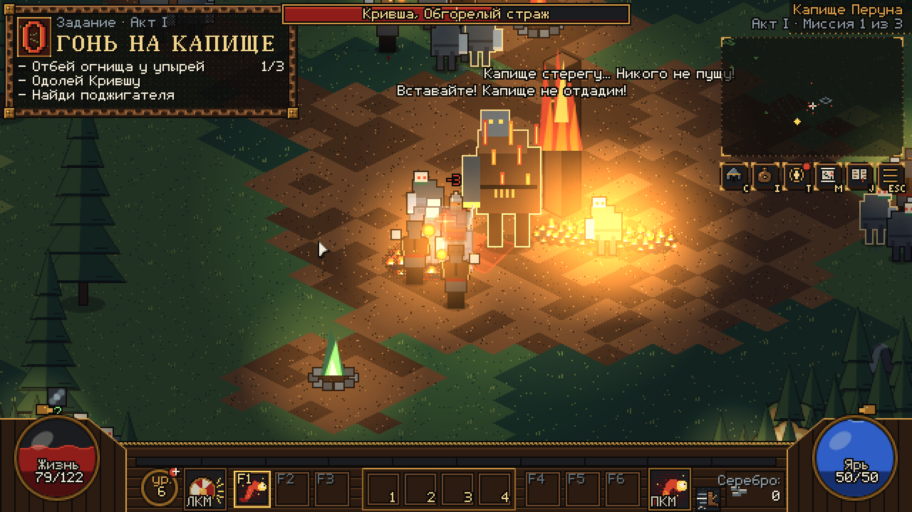

# «Быль и Небыль» — грей-бокс прототип, итерация 2 (+ навыки, GDD v1.7, вехи M1a и M1b «Огонь на капище»)

Браузерная экшен-RPG в духе Diablo II: Северная Русь XI века, окрестности Ладоги, былины и славянский фольклор.
Локации — «Залесье», «Лесная тропа» и «Капище Перуна» (акт I «Ладога», миссия 1 «Огонь на капище»). Всё нарисовано простыми фигурами (грей-бокс) в палитре
`art/ui/palette_v2.json`; окна, кнопки и иконки предметов выгружены из исходников художника. Нативное разрешение
640×360, целочисленный масштаб ×3 (1920×1080), изометрия 2:1 (тайл 32×16).







## Как запустить

Нужен только Python 3 и любой современный браузер. Сборки, внешних зависимостей и CDN нет: чистые ES-модули,
Canvas 2D и WebAudio. Балансные конфиги `data/*.json` грузятся через `fetch()` при старте.

```sh
cd /workspace/game/prototype
./run.sh              # или: python3 -m http.server 8000
# открыть http://localhost:8000/
```

Открыть `index.html` двойным щелчком нельзя: браузер не грузит ES-модули и JSON по `file://`.

Параметры адреса: `?debug` — FPS; `?seed=N` — детерминированная случайность (для отладки и автотестов).
В консоли доступен `window.__game` (состояние игры, `give(база, редкость, {affixes})`, `dropRandom(ilvl)`,
`clientOf(x, y)`, `spawnTest(вид, x, y, mlvl)`, `simulate(сек)`, `safeAt(x, y)`, `dbg.CFG` — загруженные конфиги).

## Управление

| Ввод | Действие |
|---|---|
| ЛКМ по земле / зажать ЛКМ | идти (путь A* по полутайловой сетке, обходит нечисть) |
| ЛКМ по избе / сундуку / телу (держать у двери) | выбить дверь (держать ЛКМ 2 с, урон прерывает), открыть сундук, обыскать тело |
| ЛКМ по выходу из зоны | дойти и перейти в соседнюю зону |
| ЛКМ по нечисти (можно держать) | подойти и ударить **«Сшибкой»** (1 Ярь); не хватает Яри — обычный удар оружием |
| Shift + ЛКМ | бить на месте (по нечисти под курсором) |
| Щелчок по ячейке ЛКМ на панели | переключить ЛКМ: «Сшибка» ↔ обычный удар |
| ПКМ (можно держать) | навык, назначенный на ПКМ (на старте «Огненный змей»); нажатие во время замаха запоминается до конца замаха + 0,3 с |
| F1–F6 | назначить навык из ячейки на ПКМ; колесо мыши листает навыки панели |
| Пробел | «Рывок» на 3 тайла к курсору (КД 4 с, 0,15 с неуязвимости); во время замаха/каста запоминается и срабатывает сразу после удара |
| 1–4 (или щелчок по ячейке пояса) | выпить зелье из пояса (КД 1 с отдельно у зелий Жизни и Яри; живая вода — вне КД; полную шкалу не пьёт) |
| Alt (держать) / Z | подписи всей добычи / режим «всегда» (подпись — полное имя с аффиксами в цвете редкости) |
| Tab или M | большая карта поверх затемнённого мира |
| I или B / C / T | котомка / окно «Витязь» / окно **«Навыки»** |
| N | звук вкл/выкл (запоминается) |
| J | летопись — заглушка |
| Esc | закрыть карту или окна, иначе пауза (переключатели «Звук», «Подписи», «Мини-карта») |
| Кнопки C/I/T/M/J/ESC под мини-картой | то же, что клавиши; красная точка на C/T — есть свободные очки |

При потере фокуса окна игра встаёт на паузу (GDD §4.1).

**В котомке:** щелчок берёт предмет на курсор и кладёт (с обменом); щелчок по слоту куклы надевает; можно
перетаскивать; ПКМ по предмету надевает (зелье — выпивает, если можно); ПКМ по слоту снимает; щелчок по миру с
предметом на курсоре выбрасывает его. Подсказка сравнивает с надетым по итоговым показателям героя
(«Урон в секунду», «по нечисти», «Защита», «Жизнь», сопротивления…), для перстней — с обоими надетыми.

**В окне «Навыки» (T):** две ветви столбцами («Ратное дело» и «Ведовство»), три яруса, кнопки [+] (требуется
уровень и ранг предыдущего навыка), подсказка с числами текущего и следующего ранга. Наведите курсор на навык
и нажмите F1–F6 — навык ляжет в эту ячейку панели.

## Навыки (data/skills.json)

Значение `[a, b]` — «a на ранге 1, +b за каждый следующий ранг». Максимальный ранг 10. Очки: 1 за уровень начиная
со 2-го и 1 за миссию; стартовые ранги «Огненного змея» и «Сшибки» бесплатные (к 16-му уровню — 18 очков
к распределению, GDD v1.5 п.1).

| Навык | Ветвь, ярус, ур. | Суть | Числа (ранг 1 / за ранг) |
|---|---|---|---|
| Сшибка | Ратное, I, 1 | удар оружием на ЛКМ | **175% урона оружия (+7%)** (GDD v1.6), +20% меткости (+5%), 1 Ярь; отброс 1 тайл — ранги 1–2 только у добивающего удара, с 3-го ранга ещё и у крита, обычные попадания не отбрасывают |
| Чур-оберег | Ратное, II, 6 | бафф 30 с | +50% защиты (+15%), +5% ко всем сопротивлениям (+1), 15 Яри, каст 0,5 с |
| Богатырская стать | Ратное, II, 6 | пассивный | +5% жизни (+5%), +3% физ. урона (+3%) |
| Круговая сеча | Ратное, III, 12 | поддерживаемый | в данных; в прототипе «появится позже» |
| Огненный змей | Ведовство, I, 1 | снаряд с взрывом | 6–10 огня (+3/+4), 5 Яри (+0,5), радиус 1, дальность 12 |
| Дыхание Морозко | Ведовство, II, 6 | снаряд холода | 4–7 (+2/+4), **дальность 12**, замедление 50% (бег, удар, бросок) на 2 с (+0,3), по боссам/элите/вожакам — 25%, 4 Яри |
| Вещее слово | Ведовство, II, 6 | пассивный | +10% восстановления Яри (+10%), +6% стихийного урона (+6%) |
| Перунов скок | Ведовство, III, 12 | перенос к курсору с ударом молнии | дальность 6 (+0,5), 5–10 огня (+1/+2) в радиусе 1, 20 Яри (−1), **КД 3 с** |
| Рывок | вне ветвей | Пробел | 3 тайла за 0,2 с, КД 4 с |

На панели: ЛКМ, 6 ячеек F1–F6, пояс, ПКМ, «Рывок». Иконка на перезарядке закрывается сектором по часовой стрелке
с секундами; при нехватке Яри ячейка ПКМ и F-ячейки серые (ячейка ЛКМ не сереет — «Сшибка» тогда бьёт обычным
ударом). Над шаром жизни — значок «Чур-оберега» с остатком времени.

**8 направлений.** Герой и нечисть поворачиваются в 8 сторон (`sprites.js`, `dir` 0–7: 0 — к камере, далее по
часовой стрелке), направление берётся по экранному углу к цели.

## Веха M1a: «Огонь на капище» (act1.md, act1_texts.md, GDD v1.6)

- **Трекер миссии** в левом верхнем углу (макет `art/ui/hud_quest.png`): «Задание · Акт I», название
  «Огонь на капище», не больше 3 строк «— цель  n/N»; выполненные цели получают галочку и гаснут, следующие видны
  серым. Машина состояний — в `data/quests.json` (hidden → locked → active → done, условия — события игры,
  действия — реплики, диалоги, флаги), тексты — ключи `data/ru.json` (`src/systems/quest.js`, `hud.js`).
- **Залесье:** три избы. Дверь выбивается удержанием ЛКМ 2 с, только когда стая у избы перебита; урон прерывает
  («Прервано!»). Из изб выбегают селяне с репликами. В третьей избе у колодца — **Мал**; его диалог открывает
  выход на тропу сразу после избы 3, остальные избы для этого не нужны (GDD §8.2, триггер `hutFreed hut3`) (до этого — «Тропу покажет Мал. Он в избе у колодца.»).
- **Лесная тропа** (`data/zones/trail.json`, `src/world/trail.js`): коридор 128×48 через лес, переход
  Залесье ↔ тропа через выходы у краёв (состояние зон сохраняется: убитые остаются убитыми). mlvl 2 → 3 по ходу
  тропы: 25 врагов mlvl 2 (упыри 16 / анчутки 9) + 45 mlvl 3 (упыри 20 / анчутки 14 / поджигатели 11), 16 стай,
  4 «волны» упырей встают из земли, когда герой подходит. Кованый сундук (гарантированно заговорённое оружие
  ilvl 3 + бросок по таблице `trailChest`, подсказка «I — котомка»). Тело жреца: заветное «Чёрный нож» и
  «Грамота жреца» (берестяной лист на экране). У ворот капища — Чуров камень (тихий круг 6); ворота закрывают
  цель «Доберись до капища» и ведут в капище (веха M1b). Гибель на тропе — возвращение у крады Залесья;
  убитые на тропе не возвращаются (GDD v1.7), недобитые ушли к логову и восстановились.
- **Черноярец-поджигатель** (E11, `monsters.json`): 36 HP / 4–9 на mlvl 3, сопротивление огню +25% (у анчутки
  тоже +25%). «Поджог»: герой в 2–6 тайлах → замах, факел летит в точку на 1,5 тайла ближе героя, красный
  телеграф 0,8 с, затем огонь Ø 2 тайла на 4 с, 80% среднего урона mlvl в секунду (5/с на mlvl 3), КД 8 с,
  одна зона на поджигателя; сам в огонь не заходит, в тихий круг огонь не ставится. Первая встреча — реплика
  «Люди с факелами… Значит, жгли не мёртвые.» и цель «Найди поджигателя».
- Капище, Мара и Кривша — веха M1b (ниже); береста-журнал и былинные вещи — веха (в).

## Веха M1b: капище Перуна, Мара, Кривша (GDD v1.7, act1)

- **Ответы дизайнера 08.10 (часть 1):** поджигатель r 0,4 / досяг 1,0 / агро 9; факел: замах до кадра 3 (0,3 с), полёт
  по дуге 0,6 с при любой дистанции (спрайт `fx_torch_flight`), красный круг с момента броска 0,8 с, огонь в конце
  телеграфа (спрайт `fx_burning_ground`), r 1, 4 с, 0,8× среднего урона mlvl/с, тик 0,5, КД 8. Агро всех обычных врагов 9.
  Принятые заглушки сняты (заметность 9, зачистка избы 4, засада 5 / 0,8 с, фейд кольца 0,25). Неуязвимость
  возрождения 2 с снимается атакой или кастом. «Убито N/28» — только в отладочном слое (`?debug`).
- **Вожаки и матёрые** (`stats.json → elites`, `src/systems/elites.js`): 3 вожака М1 — один на тропе (вторая половина,
  mlvl 3, упырь или анчутка) и два у огнищ 1 и 2; имя из генератора act1 §9, 1 модификатор (М1), ×4 HP / ×1,8 урона /
  ×4 опыта, свита ×1,5 опыта; гибель вожака пугает анчуток стаи. У огнища 3 — три матёрых упыря (×3 HP).
- **Возрождение:** у крады Залесья, пока не тронут Чуров камень у входа в капище (подойти ближе 1,5 тайла или щёлкнуть);
  после — у камня. Других тихих кругов на тропе нет, в капище их нет вовсе.
- **Капище Перуна** (`data/zones/kapishche.json`, `src/world/kapishche.js`): 64×64, mlvl 4–5, вход через ворота тропы.
  80 врагов (45 mlvl 4 + 35 mlvl 5), три огнища: перебить пачку, затем держать ЛКМ 3 с; цель «Отбей огнища у упырей 0/3».
  «Чад» (GDD §4.4): ступень за каждое неосвящённое огнище, −10% Яри и −5% меткости за ступень, иконка над шаром Жизни.
- **Мара Пепельная** (`data/bosses.json`): былинный враг mlvl 4 в Залесье — 258 HP, 8–18, «Жаркая», свита 4–6 анчуток
  mlvl 2, бродит кругом, пепельный след (8% HP/с), лечит свиту, реплики act1 §7, добыча по таблице «bylina».
- **Кривша, Обгорелый страж** (`src/entities/boss.js`): mlvl 6, 1425 HP, 14–30, встаёт из пламени идола, когда герой
  входит в Круг огнищ (7 тайлов от идола) или освящено третье огнище. Удар когтями — конус 2 тайла с телеграфом 0,6 с;
  огненный след; 2 упыря каждые 15 с (не больше 4); на 50% — прыжок в ближайшее неосвящённое огнище (2 с неуязвим),
  огненный ореол r 1,5 (6% HP/с), +25% скорости атаки, сопр. огню +25%; если все огнища отбиты — фазы нет. Полоса
  здоровья босса сверху. Гибель: 4 предмета (≥ 2 заговорённых), «Приказ Чернояра» на теле (закрывает «Найди
  поджигателя»), идол гаснет, «Громовник» — заглушка вехи (в); «Миссия пройдена», награда Ладоги — заглушка в журнале.
- **Исправления по QA m1a:** B-26, B-27, B-28, B-29 (п. 5 ответов), B-30 — см. `REPORT_m1b.md`.

## GDD v1.7 «Отдых и стаи»

- **Мир после гибели:** убитые враги не возвращаются (`repopulate: "onNewSession"` во всех зонах — полные зоны только
  в новой сессии, т. е. при перезагрузке страницы). Недобитые уходят к логову и восстанавливают HP, как по поводку.
  Трекер назад не идёт. Гибель снимает баффы и обнуляет перезарядки.
- **Отдых:** в тихих кругах (крада r 10, Чуров камень r 6) Жизнь и Ярь +20% от максимума в секунду, если 2 с без урона
  (`safeZones[].rest: {pctPerSec: 20, noDamageSec: 2}`). При первом отдыхе — совет `tip.13` (экрана загрузки в прототипе нет).
- **Эффекты отдыха — спрайты художника** (`art/sprites/fx_rest_*`, `fx_safe_ring` → `assets/fx/`, код `src/render/rest_fx.js`):
  крада и Чуров камень — анимированные объекты «покой» / «отдых»; обе петли в одной фазе (кадр — функция времени),
  переключение без сброса кадра; «отдых» — пока идёт восстановление. Свет крады в отдыхе шире и ярче (3 → 4 тайла, +25%).
  Искры над героем (`fx_rest_sparks`) — пока растут Жизнь или Ярь, петля доигрывает до конца. Кольцо рез на границе
  собирается из кусков по раскладке JSON (R10 — 91 кусок, R6 — 55), 50% прозрачности, видно только в 3 тайлах от
  границы или во время отдыха (тогда бронзовое). Позы героя нет. Числа — `stats.json → restFx`.
  Костёр М3 (`fx_rest_campfire`) загружен, но костров в прототипе пока нет.
- **Залесье — 28 врагов:** 20 упырей / 8 анчуток, 18 mlvl 1 + 10 mlvl 2; стаи анчуток mlvl 2 — по 3
  (`mlvlRules.packSize["2"].anchutka: [3, 3]`), стая у выхода — «3 упыря + 1 анчутка» (`mixedMax`).
  Опыт зоны — в `tools/balance_iter2.json` (цель ≈ 282, допуск 270–330).
- **Ввод во время замаха/каста** (Пробел / ПКМ / ЛКМ) копится до конца действия, срабатывает последний.
- **«Перунов скок» по врагу** — приземление перед целью на `r героя + r врага`.
- **F1–F6** над навыком в окне «Навыки» в занятую ячейку — обмен; в окне — короткие имена (`short` из act1_texts §16:
  «Оберег», «Стать», «Змей»…); отказы — короткие тосты `ui.skills.req_level` / `req_skill` / `no_points`.
- **Экран гибели:** Пробел / Enter — не раньше 2,5 с (кнопка — с 1,5 с), `stats.json → death.keyDelay`.
- **«Рывок» с курсором над окном** — к точке мира под курсором; окна не глотают клавиши, только щелчки.
- **Сравнение перстней** учитывает Силу, Ловкость, Живучесть и Дух.

## Баланс GDD v1.6

- «Сшибка» 175% (+7%/ранг), правило отбрасывания (см. таблицу навыков). Стартовая броня 5/4/9, Защита 1-го ур. 23;
  контрольные шансы попадания 78 / 57 / 41 / 88% проверяются автотестом.
- «Морозко»: дальность 12, по сильным — половина замедления.
- Зелья: КД 1 с отдельно для Жизни и Яри; живая вода — мгновенно и вне КД.
- Тихие круги: враги не атакуют героя внутри; вражеские снаряды гаснут на границе; огонь внутрь не ставится;
  враг, которого бьют из круга, уходит к логову и восстанавливается (как по поводку).
- Замер выживания стоя — по комплектам дизайнера (3/6/10-й ур., 3 упыря mlvl = уровень героя, отсчёт с момента,
  когда все трое рядом, блок 0, 30 прогонов). Итоги — в `tools/balance_iter2.json`.

## Что сделано в итерации 2

### Бой и физика
- **Полутайловая сетка** (`design/scale.md`): сабтайлы ½ тайла, A* с шагом 0,5, радиусы тел (герой 0,30, анчутка
  0,25, упырь 0,35). Нечисть — твёрдые тела, путь героя их обходит.
- **Взрывы не бьют через стены** (прямая видимость от центра взрыва).
- **Хит-стоп 50 мс**, отбрасывание, тряска, оглушения по GDD.
- **Анчутка** держит дистанцию и кидает угли (от угля можно уйти), отскакивает, пугается гибели сородичей.
  **Упырь** медленный, бьёт больно, иммунен к порче, **уязвим к огню (−25%)**.
- **Шанс попадания** (GDD v1.5 п.8): `2·AR/(AR+DEF) × (L_A+5)/(L_A+L_D+10)`, предел 5–95%.
- Мини-карта с туманом разведки, большая карта по Tab (с затемнением), звуки-заглушки WebAudio.

### Зона «Залесье» (`data/zones/zalesye.json`, GDD v1.5)
- **28 врагов (GDD v1.7): 18 mlvl 1 + 10 mlvl 2, 20 упырей / 8 анчуток, без элиты**, 8 стай.
  Первая половина пути — mlvl 1, вторая — mlvl 2.
  Стаи: mlvl 1 — упыри 3–4, анчутки 4–5; mlvl 2 — упыри 3, анчутки 3, смешанная не больше 3+1.
  Первая встреча — 3 упыря mlvl 1.
- **Безопасные зоны:** крада (радиус 10) и **Чуров камень у колодца** во второй половине зоны (радиус 6).
  Центры стай не ближе `радиус + 2` (12 / 8). Нечисть туда не забредает, не замечает героя внутри, погоня
  обрывается, атаки по герою внутри зоны не идут.
- Выход в юго-восточном углу — на «Лесную тропу» (открывает Мал); заготовка `kapishche.json` (45 mlvl 4 + 35 mlvl 5).
  Контрольная точка Залесья — выйти 2-м уровнем (±1).
- На плашке зоны — «Залесье»; трекер миссии «Огонь на капище» (см. выше).

### Гибель (GDD §4.5)
- Экран «Пал ты, дружинник…», кнопка «Очнуться у крады» через 1,5 с. Штраф −10% носимого серебра (вверх).
  Кнопка «Очнуться у крады» — через 1,5 с, Пробел / Enter — через 2,5 с. Возвращение у огня крады с полными шкалами
  и 2 с неуязвимости (и 2 с, когда нечисть не замечает героя).
  Гибель снимает «Чур-оберег» и обнуляет перезарядки навыков, рывка и зелий (QA B-24). Убитые не возвращаются (GDD v1.7).

### Котомка, снаряжение, подписи
- Окна «Котомка» (кукла 10 слотов, сетка 10×4) и «Витязь» (свойства [+], показатели, сопротивления) по макетам.
- Подсказки на русском с цветом редкости; сравнение с надетым по итоговым показателям.
- Подписи добычи раскладываются без наложения (стопкой) даже при 24 предметах в куче.
- Пояс автоматически пополняется зельями из котомки.
- Стартовый комплект по GDD §6.2.

### Конфиги (GDD §15)
Все числа — в JSON, грузятся `fetch()` при старте:

| Файл | Что внутри |
|---|---|
| `data/stats.json` | формулы героя (Жизнь, Ярь, восстановление Яри 1,5%/с), меткость, защита, шанс попадания, кривая опыта, шкала монстров, оглушения, хит-стоп, штраф смерти |
| `data/skills.json` | правила очков и стартовых рангов, 2 ветви, 8 навыков, «Рывок» |
| `data/monsters.json` | упырь и анчутка: множители, скорость, КД, сопротивления (знак: `урон × (1 − res)`; упырь огонь −0,25), дальний бой, страх |
| `data/bosses.json` | заготовка боссов (не реализованы): Мара, Леший (огонь −0,25), Кривша (огненная фаза +0,25) |
| `data/items_base.json` | слоты, редкости, базы по тирам, стартовый комплект, зелья, пояс |
| `data/affixes.json` | префиксы и суффиксы по тирам; «Ратный» даёт +ранг навыкам ратного дела, «Вещий» — ведовства |
| `data/uniques.json` | заготовка былинных предметов |
| `data/droptables.json` | таблицы выпадения и серебра; выбор базы: верхний доступный тир 50%, предыдущий 35%, прочие 15% |
| `data/ru.json` | русские строки интерфейса (`src/core/i18n.js`: `t()`, склонения `plural()`, тексты серебра); перенос строк частичный |
| `data/zones/*.json` | Залесье, Тропа, Капище: стаи, безопасные зоны, ориентиры, контрольные уровни |

### Исправления по QA (iter1.md, iter2.md, iter2b.md)
B-01…B-19 закрыты (B-10 — изменено по решению: F5 теперь клавиша панели). По iter2b:
- **B-20** — неуязвимость «Рывка» больше не обрывает погоню (ИИ смотрит на `graceT` возрождения, а не на `invuln`).
- **B-21** — уголь гаснет на границе тихого круга и при касании героя, уже стоящего в круге; огонь в круге не жжёт.
- **B-22** — «Перунов скок» по врагу приземляет героя у края тела (и перепроверяет точку в момент прыжка).
- **B-23** — Пробел во время замаха/каста запоминается; **B-02** — ПКМ запоминается на весь замах + 0,3 с.
- **B-24** — гибель снимает баффы и обнуляет перезарядки. **B-25** — состав Залесья по GDD v1.7: 28 = 20 упырей / 8 анчуток.
- **B-18** — сравнение предметов показывает Силу / Ловкость / Живучесть / Дух.
- Щелчок мыши обрабатывается по точке нажатия, даже если до ближайшего кадра курсор ушёл (редкие кадры).

## Структура кода

```
index.html, run.sh
data/                 балансные конфиги JSON, zones/ — по файлу на зону
assets/               items.png, win_inventory.png, win_character.png, win_skills.png, hud_buttons.png, hud_quest.png;
                      fx/ — эффекты отдыха и кольцо рез художника (PNG + JSON)
src/
  main.js             вход: loadConfig() → loadAssets() → игра; масштаб; цикл
  game.js             состояние, ввод, камера, безопасные зоны, смерть и возвращение, хуки для тестов
  core/               i18n.js (ru.json, plural), input, iso, math, rng, font
  data/               config.js, progression.js (шанс попадания, опыт), enemies.js, skills.js, items.js, ui_atlas.js, font_ru.js
  world/              map.js (локация, стаи, избы, объекты, колодец, Чуров камень, выходы), trail.js (Лесная тропа), collision.js, pathfind.js
  entities/           actor.js, hero.js (свойства, навыки, ЛКМ/ПКМ, зелья, взаимодействие), enemy.js (ИИ, угли, факелы, волны, тихие круги), npc.js (селяне, Мал)
  systems/            combat.js (снаряды, огонь), quest.js (миссия и трекер), zones.js (переходы зон, объекты, реплики), loot.js, inventory.js, audio.js, fx.js, log.js
  render/             world.js, props.js, rest_fx.js (эффекты отдыха), sprites.js (8 направлений), hud.js (панель навыков), minimap.js, screens.js, shapes.js
  ui/                 assets.js, windows.js (котомка, витязь, сравнение), skills_window.js (окно «Навыки»)
tools/
  export_ui.py, export_font.py, export_ru.py   выгрузка ассетов, шрифта и строк
  verify_playwright.py                          автопроверка
  balance_iter2.json                            результаты балансных прогонов последней автопроверки
```

## Автопроверка

```sh
python3 -m http.server 8765 --bind 127.0.0.1 &        # из папки prototype
python3 -m venv /tmp/pw && /tmp/pw/bin/pip install playwright
/tmp/pw/bin/python tools/verify_playwright.py --chrome /usr/bin/google-chrome
```

131 проверка (`--throttle N` — то же под замедлением ЦП в N раз через CDP). Помимо проверок итерации 2:
- **Веха M1a:** трекер «Огонь на капище», закрытый выход, избы 1–3 (удержание мышью и прерывание уроном), Мал, переход
  на тропу, состав тропы (mlvl 2→3), поджигатель (статы, сопротивление огню +25%, факел и огонь, первая встреча),
  волны, сундук, жрец, ворота, возвращение в Залесье, гибель на тропе по v1.7, `screenshot_m1a.png`.
- **Баланс v1.6:** «Сшибка» [175, 7] и правило отбрасывания, стартовая броня и шансы попадания 78/57/41/88,
  «Морозко» (дальность 12, 25% по сильным), КД зелий по видам, правила тихих кругов.
- **QA iter2b:** B-02, B-18, B-20…B-25 (каждая отдельной проверкой).
- **GDD v1.7 п. 1–9:** мир после гибели, отдых, состав Залесья 28 (20/8, 18/10), «последний ввод побеждает»,
  приземление «Скока», обмен F1–F6 и короткие имена, тосты отказов, экран гибели 2,5 с, «Рывок» над окном,
  сравнение перстней; эффекты отдыха художника (фаза, искры, кольцо рез).
- **Веха M1b** (`tools/checks_m1b.py`, отдельно — `--only-m1b`): B-26…B-30, ответы дизайнера пп. 1–6, капище, Мара, Кривша
  (появление, когти, призыв, фаза, гибель, добыча), замеры боя с Крившей и опыта, `screenshot_m1b.png`.
- **Балансные прогоны** (на время прогонов — свой генератор случайных чисел с постоянным зерном, стаи зоны убраны):
  TTK «Сшибкой» (60 боёв), мечом, огнём; опыт Залесья; 1 ур. vs 3 упыря mlvl 1, 2 ур. vs 3 упыря / 3 анчутки /
  «3 упыря + 1 анчутка» mlvl 2 (по 30); выживание стоя по комплектам дизайнера на 3/6/10 ур. (по 30).
  Результаты — `tools/balance_iter2.json`.

Устойчивость: проверки ждут в игровом времени, после принятия ввода шагают мир фиксированным шагом; щелчки в
проверках направления и буфера ПКМ — настоящие DOM-события мыши, нажатие и отпускание в одной задаче.
Скрипт сохраняет `screenshot_m1a.png`, `screenshot_iter2_gameplay.png`, `screenshot_iter2_inventory.png`,
`screenshot_iter2_skills.png`. Последние прогоны: 3 обычных прогона подряд — 131/131 (консоль чистая); прогон с `--throttle 4` — 131/131 (08.10.2026).

## Расхождения с GDD и допущения

- Ветви навыков показаны двумя столбцами в одном окне, а не вкладками.
- Зелья: КД 1 с отдельно у Жизни и Яри; полную шкалу зелье не пьёт.
- Возвращение у крады Залесья вместо Ладоги (в том числе после гибели на тропе).
- Короткие имена навыков показаны в окне «Навыки»; ячейки F1–F6 на панели 26 px — имя туда не помещается, оно в подсказке.
- Совет `tip.13` — тостом при первом отдыхе за сессию (экрана загрузки с советами в прототипе нет); длинные тосты
  переносятся на 2 строки под трекером.
- Кольцо рез: прозрачность 50% и правило видимости — по решению дизайнера (у художника: «всегда тускло, у границы ярче»).
- Колодец и Чуров камень поставлены у (35, 37) / (33, 36), выход — юго-восточный угол; избы 1–3 — стаи у построек.
- Герой из безопасной зоны может бить нечисть; она уходит к логову и восстанавливается.
- Посохов нет; Мара и прочие боссы только в `bosses.json`; «Круговая сеча» не реализована.
- `data/ru.json`: в него вынесена часть строк, остальные пока в коде.
- Подсказка «Урон в секунду» учитывает удачный удар.

## Известные ограничения

- `?seed` фиксирует случайность, но бой в реальном времени немного зависит от частоты кадров. Автопроверка
  ждёт в «игровом» времени (не меньше 2 кадров) и после принятия ввода шагает мир фиксированным шагом
  (`simulate`), поэтому не зависит от частоты кадров; `--throttle N` замедляет ЦП для проверки.
- Звук начинает работать после первого щелчка или клавиши (политика браузеров).
